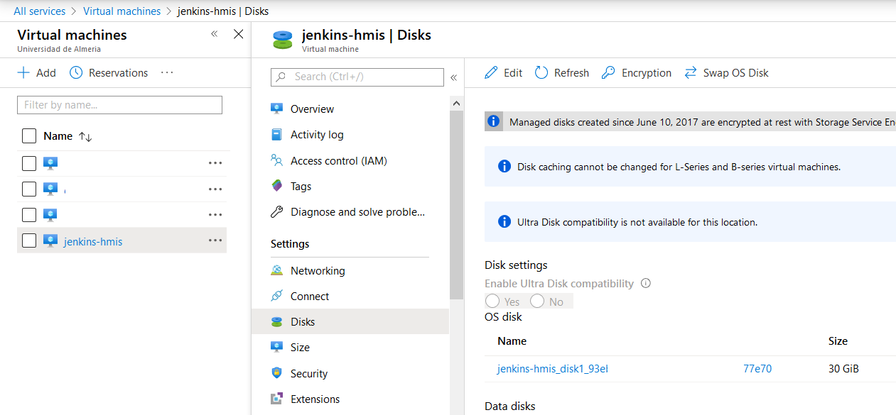
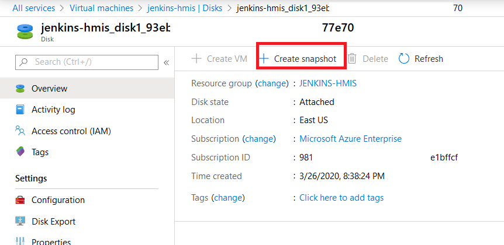
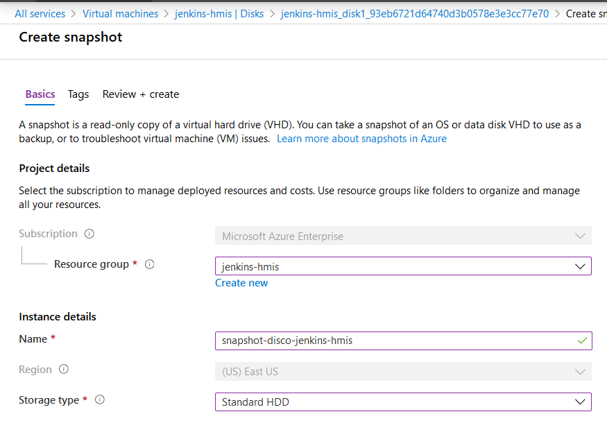
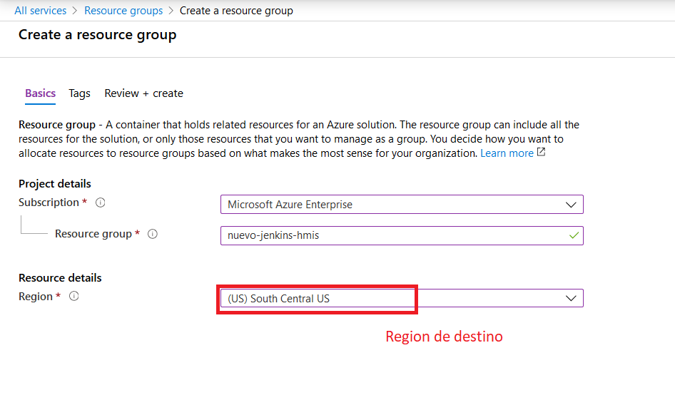
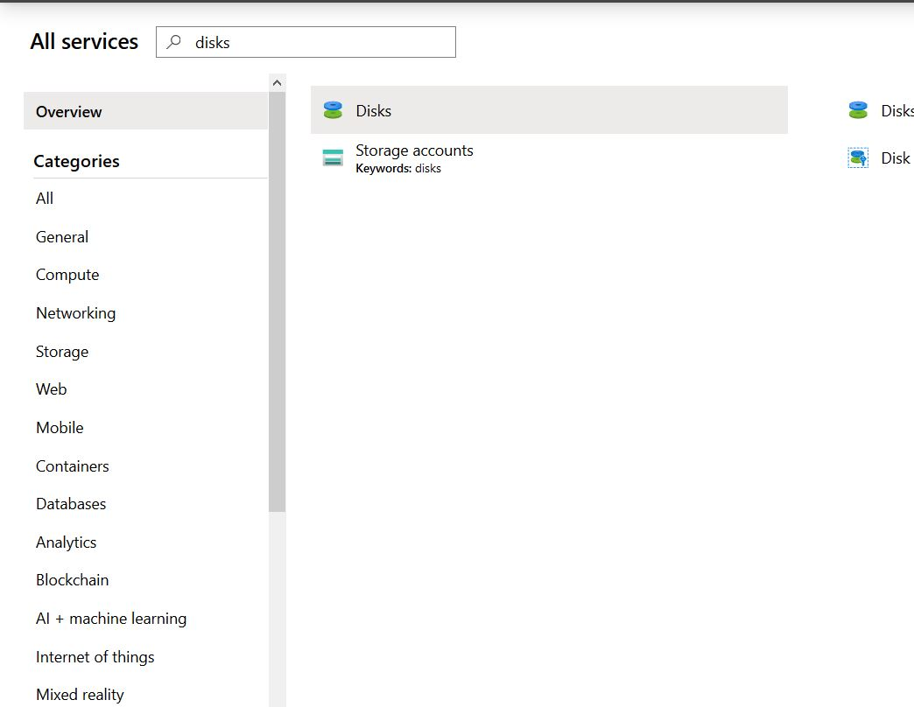
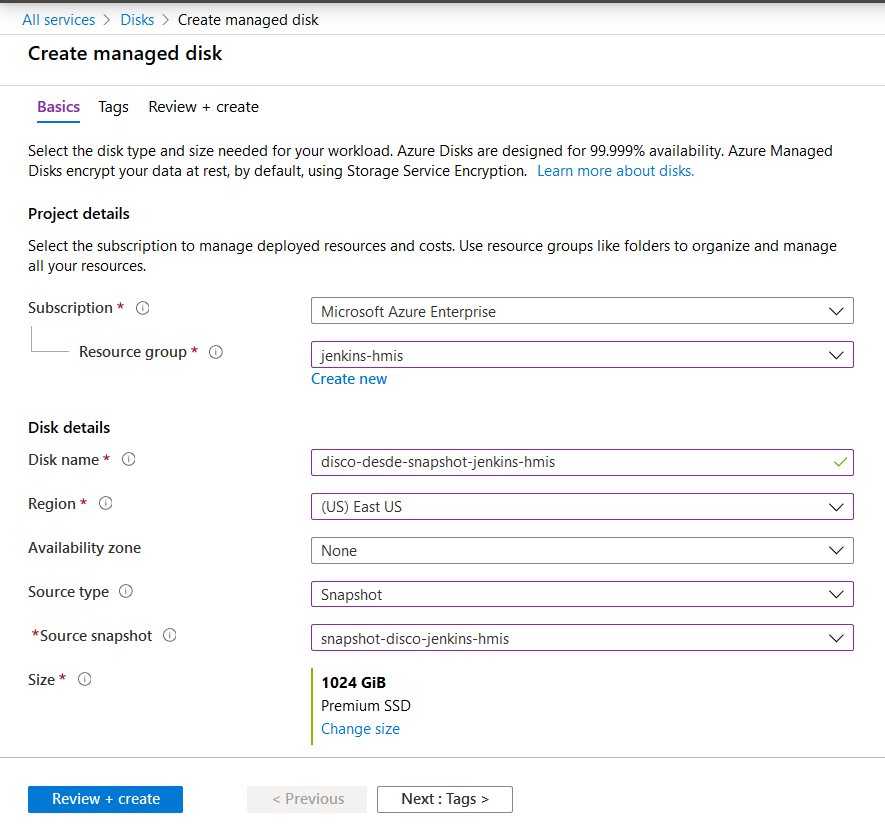
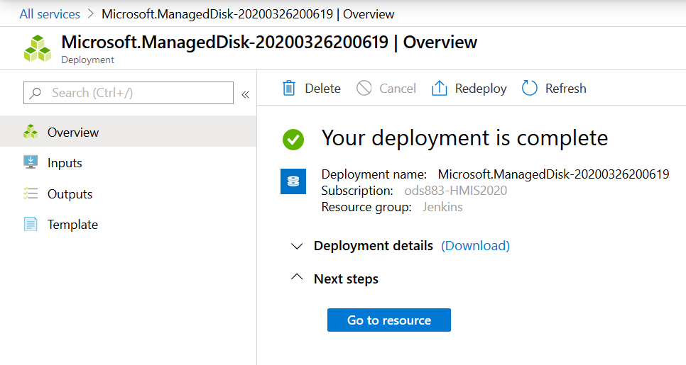
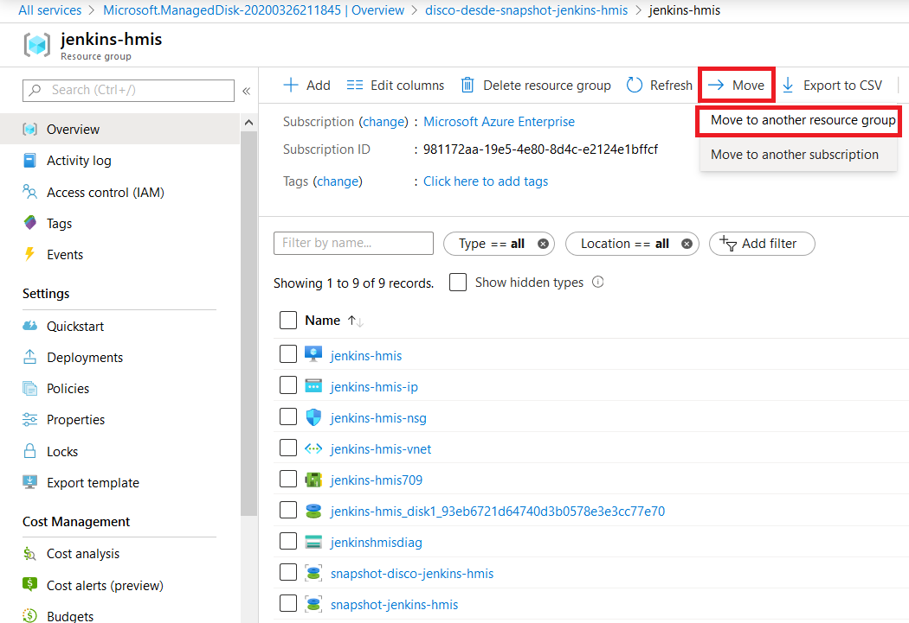
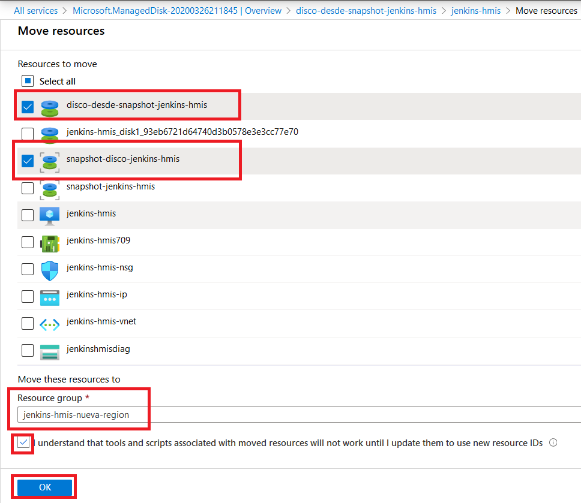

////
Codificación, idioma, tabla de contenidos, tipo de documento
////
:encoding: utf-8
:lang: es
:toc: right
:toc-title: Tabla de contenidos
:keywords: Azure virtual machine snapshot
:doctype: book

////
/// activar btn:
////
:experimental:

////
Nombre y título del trabajo
////
= Crear una copia de una máquina virtual
Heramientas y Métodos de Ingeniería del Software
Version 1.0, Marzo-2020
Joaquín Cañadas <jjcanada@ual.es>

// Entrar en modo no numerado de apartados
:numbered!: 

[abstract]
////
COLOCA A CONTINUACION EL RESUMEN
////
Creación de una copia de una máquina virtual en otra región de Azure. *ESTA TAREA ES IMPOSIBLE HACERLA CON EL PORTAL, AL MENOS POR AHORA*. Los pasos descritos fallan al final del proceso. Lo dejo documentado para guardar registro del tiempo que he peridio (mas de 3 horas).
Primero se describe como crear una instantanea (snapshot) de una máquina virtual existente, y luego cómo se crea una nueva máquina virtual a partir de una instantanea

////
COLOCA A CONTINUACION LOS OBJETIVOS
////
.Objetivos
* Crear una instantanea (snapshot) de una máquina virtual existente
* Crear una nueva máquina virtual a partir de una instantanea

// Entrar en modo numerado de apartados
:numbered:

# Prerequisitos

Debes tener una máquina virtual creada, y haber sufrido una incidencia de que tu máquina virtual o instancia no puede ser iniciada, del tipo: 

.Allocation failures for Virtual Machines in North Europe
[WARNING]
====
Starting at 09:12 UTC on 19 Mar 2020 you have been identified as a customer using Virtual Machines in North Europe who may receive error notifications when performing service management operations—such as create, update, scale, and start—for resources in this region.
====

En ese caso, la solución es hacer una copia de la instancia en otra región de Azure.

# Crear una instantánea

Una instantánea es una copia completa de solo lectura de un disco duro virtual (VHD). Haga una instantánea de un disco duro del sistema operativo para realizar una copia de seguridad o para solucionar problemas de la máquina virtual.

Si va a usar la instantánea para crear una máquina virtual, se recomienda un cierre limpio de la máquina virtual antes de realizar una instantánea para así limpiar cualquier proceso que esté en curso.

# Pasos a realizar en el Portal de Azure

Para crear una instantánea, complete los siguientes pasos:

. En Azure Portal, seleccione *Maquinas Virtuales*, 
. Seleccione la *máquina virtual* para la que desee crear la instantanea.
. Seleccione *Discos*. A continuación, seleccione el disco de sistema operativo de esa instancia

. Seleccione  *Crear instantánea*.

. Seleccione un *Grupo de recursos* existente de la máquina virtual.
. Escriba un *nombre* para la instantánea.
. Seleccione el *tipo de cuenta* que se usará para almacenar la instantánea. Use *Standard_HDD*.

. Seleccione *Revisar + Crear*, a continuación *Crear*.

# Creación de una máquina virtual en una nueva región a partir de una imagen administrada

Cree una máquina virtual en una nueva región a partir de una instantánea. Para ello,cree primero un disco administrado a partir de la instantánea y conéctelo como disco del sistema operativo a la nueva máquina virtual, siguiendo los siguientes pasos: 

. Cree un nuevo grupo de recursos en la nueva región. Para ello, vaya a *grupos de recursos, añadir*. 

. En Azure Portal, seleccione *Discos*

. Seleccione *Añadir* nuevo disco. Aparece la ventana *Crear Disco administrado*.
. Seleccione el *Grupo de recursos* existente donde se encuentra la instantanea.
. Escriba un *nombre* para el disco.
. Seleccione la *región donde se encuentra la instantanea*.
. Como *Tipo de origen*, elija *Snapshot*
. Como *Instantanea de origen*, seleccione la instantea creada anteriormente.

. En *Tamaño*, seleccione *cambiar tamaño*. A continuación, elija tipo *Standard HDD* y tamaño *32 GB*.

image::images/change-size.png[Disco desde snapshot]

. Seleccione *Revisar + Crear*, a continuación *Crear*.

. Vuelva al *grupo de recursos* donde guardó el disco administrado. Seleccione *Mover*.

. Seleccione el disco administrado y la instantanea, elija el grupo de recursos de destino, y marque la opción necesaria para pulsar Ok.

. Tras unos segundos de validación, ... minutos ... mas minutos ... Los recursos se copian pero se mantienen en la región origial. POR TANTO, LA MAQUINA VIRTUAL SE CREA EN LA REGIÓN ORIGINAL Y TODOS ESTOS PASOS SON INÚTILES. 